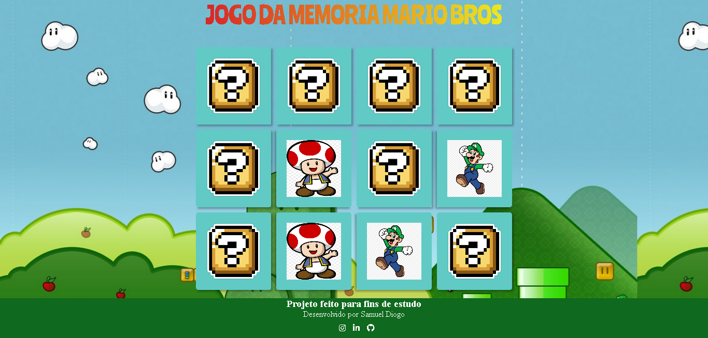

# jogo-da-memoria-DIO
Nesse projeto, o desafio será criar um jogo da memória utilizando apenas HTML, CSS e Javascript. 
Projeto feito para fins de estudo. Digital Innovation ONE.

## slide

### O DESAFIO
- O objetivo é trabalhar com efeitos 3D no CSS e lógica de programação utilizando condicionais, Immediately Invoked Function Expression e manipulação de Array em um projeto super divertido.

### RESOURCES

- HTML, CSS AND JAVASCRIPT.
- IMAGES: JPG, PNG.

### Start Dev Environment for VSCode

- Open project folder in VSCode
- Install Live Server extension
- Right click index.html > Open with Live Server